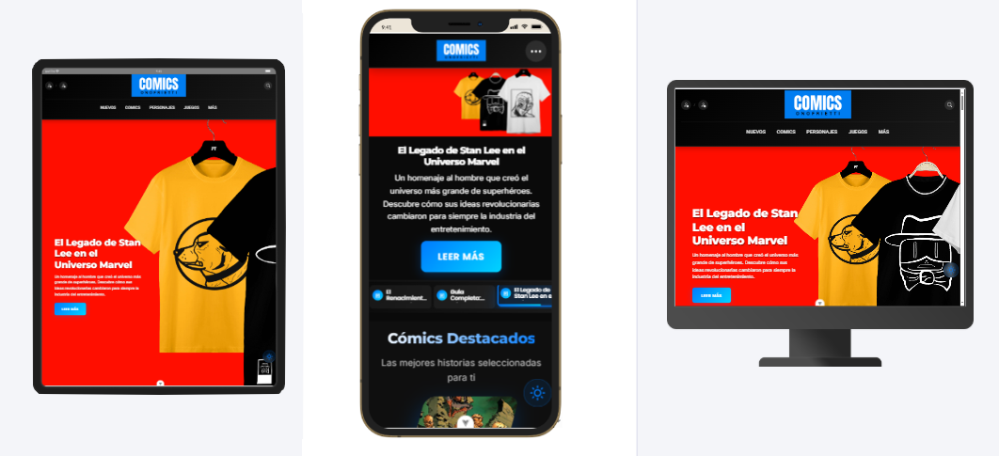

---

# comics-onofrietti


Este template te ayudará a empezar a desarrollar con Vue 3 en Vite.

## Configuración recomendada de IDE

[VSCode](https://code.visualstudio.com/) + [Volar](https://marketplace.visualstudio.com/items?itemName=Vue.volar) (y desactivar Vetur).

## Personalizar la configuración

Consulta [Vite Configuration Reference](https://vite.dev/config/).

## Configuración del proyecto

```sh
npm install
```

### Compilar y recargar en desarrollo

```sh
npm run dev
```

### Compilar y optimizar para producción

```sh
npm run build
```

### Revisa mi página oficial
https://comics-onofrietti.netlify.app/

---
